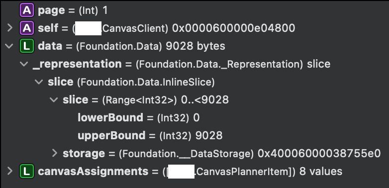
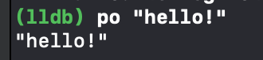
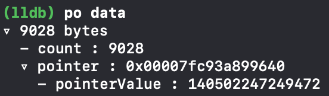
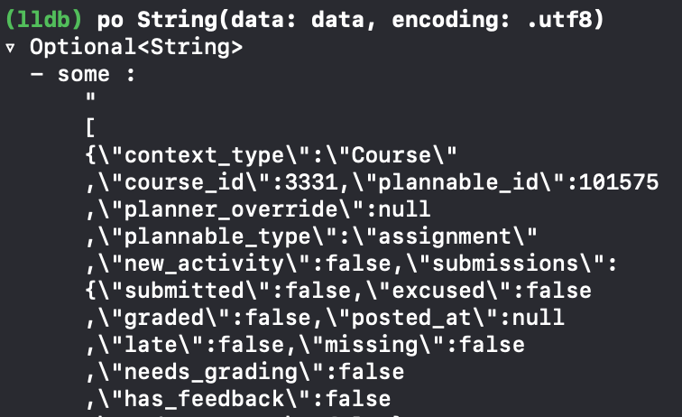
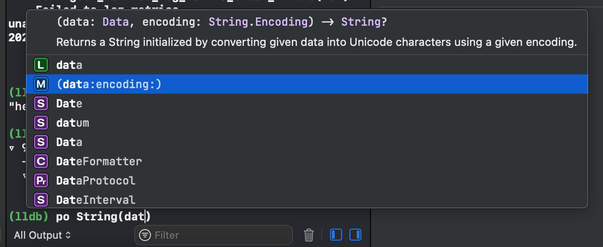
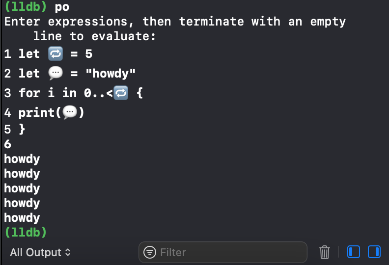

**tl;dr** Xcode's lldb allows you to do more than just view variables. You can write code that gets evaulated on the fly. Xcode even shows you completions!

For a long time, the only debugging I did was using `print` and friends. In fact, I only stumbled across breakpoints when I clicked an Xcode line number by mistake 😭. Since then, it's become way easier for me to get to the bottom of a bug. Some things I love about breakpoints:

* Call stack
* List of in-scope variables (bye bye print!)
* No more code clutter

And that's only scratching the surface. As I discovered recently, **you can actually type and run swift code inside the debugger!** Sort of like a mini REPL. 

## Example

Consider the following snippet. If JSON decoding fails, you'll probably want to inspect the bad json. 

```swift
let (data, _) = try await URLSession.shared.data(from: url)
let canvasAssignments = try decoder.decode([CanvasPlannerItem].self, from: data)
return canvasAssignments
```
Set a breakpoint at the last line and run. You get this:



The `Data` description is not very useful. Enter `po`!

## The lldb `po` command

In the debug console next to the variables view, you'll see a green `(lldb)`. To demonstrate `po`, try this:



What `po` does is **p**rint **o**ut the description of an expression. 

Just `po data` doesn't tell us anything more than the Xcode view. 



Still not helpful. Looks like we have to add this to our code. Or do we?

```swift
print(String(data:encoding:))
```

Nope! Just type the following into the debug console.

```swift
po String(data: data, encoding: .utf8))
``` 
This achieves the same thing. Voilà: 



## The debugger can evaluate **real swift code** on-the-fly

It's a whole mini-Xcode, complete with suggestions (I've found that it's snappier than the main editor too):



You can work with all in-scope variables (see the green L), classes/structs/etc (even imported ones).

## Multiple lines

If you type `po` then hit enter, you can add more lines. Strangely, Xcode completions don't work in this mode. 

You can even use emoji variable names! 



## Conclusion

lldb's `po` is really useful for situations where you need a bit more info than just a list of variables, but also don't want to clutter your code with `print`s. 

More commands: [https://lldb.llvm.org/use/map.html](https://lldb.llvm.org/use/map.html)


